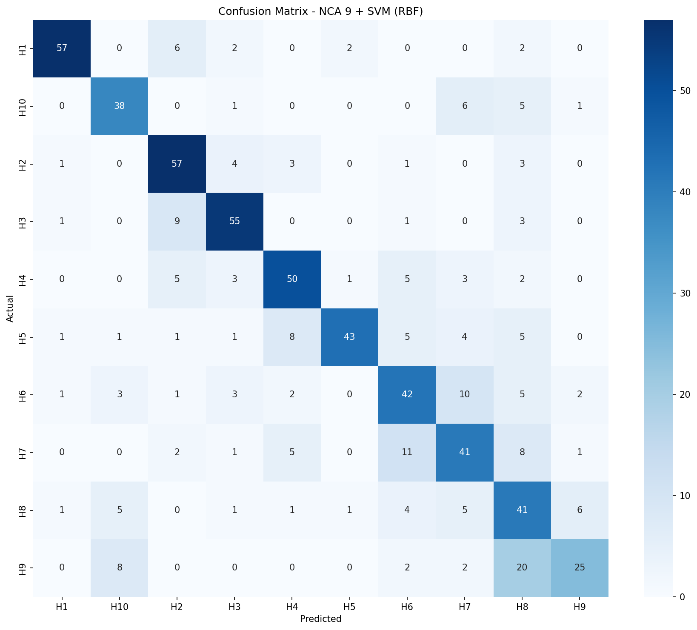
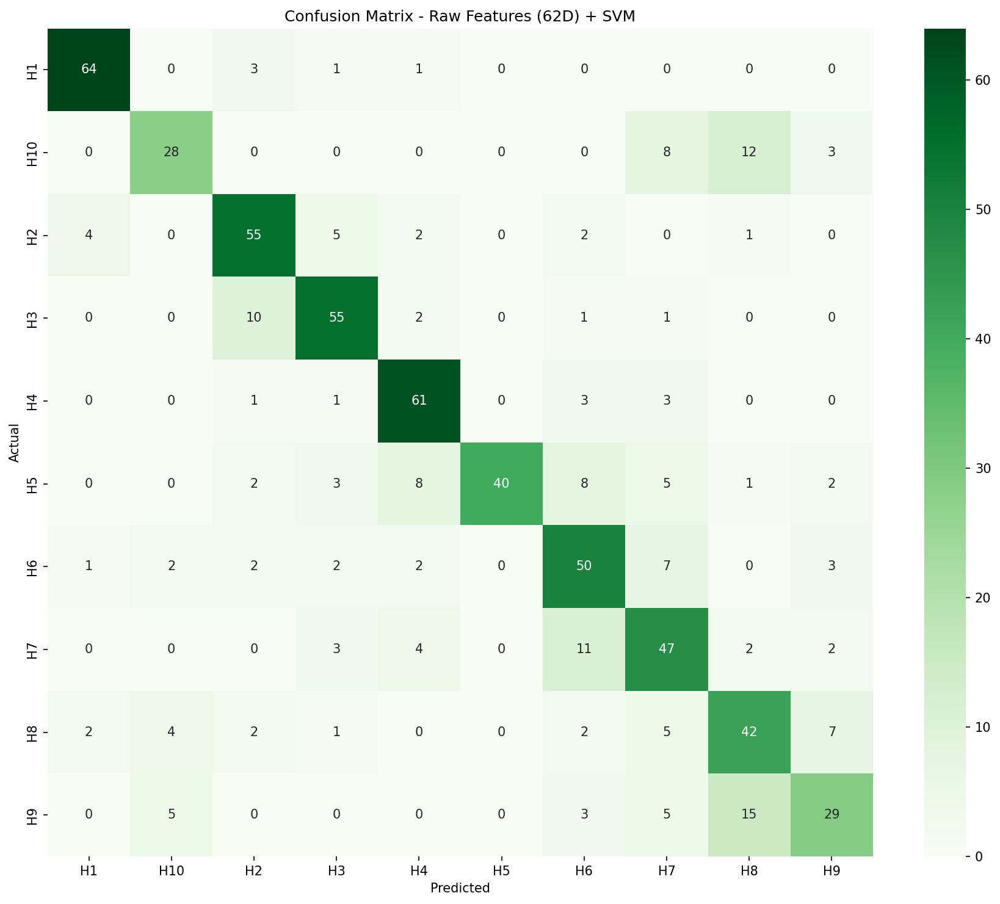
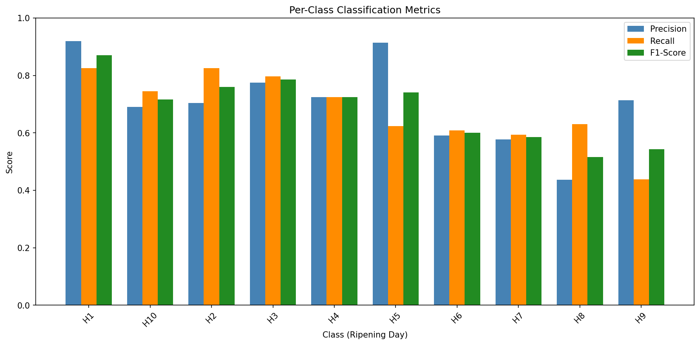
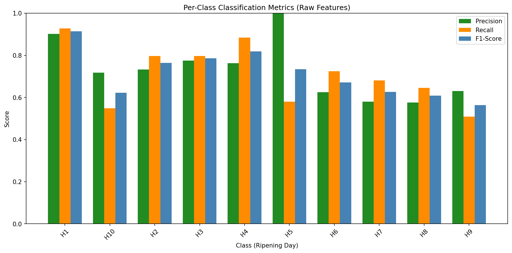
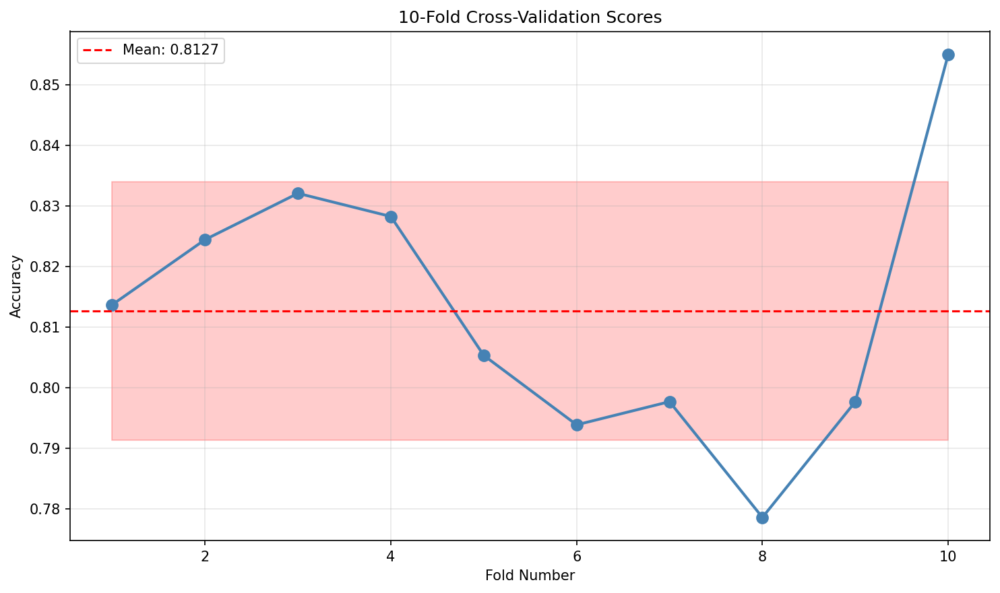

# Klasifikasi Kematangan Pisang Raja yang Dioptimalkan Menggunakan Neighborhood Components Analysis dan Support Vector Machines

**Repositori**: Proyek `pola`  
**Sumber Dataset**: [Banana Ripeness Image Dataset (Kaggle)](https://www.kaggle.com/datasets/wiratrnn/banana-ripeness-image-dataset)

> **Catatan**: Versi bahasa Inggris tersedia di [README-en.md](README-en.md)

---

## Abstrak

Estimasi kematangan buah secara akurat dan non-destruktif merupakan tantangan kritis untuk pengendalian kualitas pasca-panen, logistik rantai pasok, dan kepuasan konsumen. Penelitian ini menyajikan pipeline computer vision yang robust dan end-to-end untuk mengklasifikasikan tahap kematangan *Pisang Raja* (*Musa acuminata* × *balbisiana*), kultivar pisang yang penting secara komersial di Asia Tenggara. Kami mengusulkan framework ekstraksi fitur multi-modal yang menggabungkan deskriptor tekstur (GLCM), struktur lokal (LBP), dan warna (HSV), diikuti dengan **Neighborhood Components Analysis (NCA)** untuk reduksi dimensi diskriminatif yang supervised.

Temuan utama kami adalah bahwa **9 komponen NCA yang dioptimalkan** merupakan dimensi intrinsik untuk tugas ini, menghasilkan akurasi cross-validation **81.27%** dan akurasi test **68.45%** dengan Support Vector Machine (kernel RBF). Meskipun fitur mentah 62-dimensi mencapai akurasi test sedikit lebih tinggi (71.80%), model NCA menawarkan **reduksi dimensi 6.8×**, menjadikannya lebih layak untuk deployment pada perangkat embedded. Hasil ini menetapkan pendekatan yang berprinsip untuk sistem penginderaan kematangan yang efisien dalam IoT pertanian.

---

## 1. Pendahuluan

### 1.1. Konteks Masalah

Pematangan pisang adalah proses biokimia kompleks yang didorong oleh etilen yang menghasilkan perubahan visual yang dapat diamati: degradasi klorofil (hijau → kuning), konversi pati-ke-gula, pelunakan, dan akhirnya pencoklatan akibat oksidasi enzimatik. Penilaian kualitas tradisional bergantung pada inspektur manusia, yang memperkenalkan subjektivitas, inkonsistensi, dan masalah skalabilitas.

Computer vision otomatis menawarkan alternatif non-invasif, tetapi klasifikasi kematangan *fine-grained* menghadirkan tantangan unik:
1.  **Variansi intra-kelas tinggi**: Spesimen pada hari kematangan yang sama menunjukkan variasi visual yang signifikan karena perbedaan biologis alami dan kondisi pengambilan gambar.
2.  **Variansi inter-kelas rendah**: Tahap kematangan yang berdekatan (misalnya, Hari 4 vs. Hari 5) secara visual mirip, memerlukan fitur diskriminatif yang menangkap petunjuk halus.
3.  **Heterogenitas sensor**: Gambar yang diambil dari kamera smartphone berbeda memperkenalkan domain shift.

### 1.2. Kontribusi

Penelitian ini memberikan kontribusi berikut:
1.  **Feature Engineering**: Kami merancang vektor fitur 62-dimensi yang menggabungkan deskriptor tekstur GLCM, histogram Uniform LBP, dan statistik warna HSV, masing-masing menargetkan modalitas visual spesifik dari kematangan.
2.  **Reduksi Dimensi Supervised**: Kami mendemonstrasikan bahwa NCA, teknik metric learning supervised, secara substansial mengungguli metode unsupervised seperti PCA dengan mengoptimalkan secara eksplisit untuk separabilitas kelas.
3.  **Identifikasi Dimensi Intrinsik**: Melalui eksperimen sistematis, kami mengidentifikasi $d=9$ sebagai dimensi embedding optimal, memangkas satu komponen noise yang menurunkan performa pada baseline $d=10$.

---

## 2. Deskripsi Dataset

### 2.1. Sumber

Data bersumber dari **Banana Ripeness Image Dataset** yang di-host di Kaggle. Dataset ini mendokumentasikan progresi kematangan dua kultivar pisang Indonesia (*Pisang Raja*, *Pisang Ambon*) dari waktu ke waktu.

*   **URL Dataset**: [https://www.kaggle.com/datasets/wiratrnn/banana-ripeness-image-dataset](https://www.kaggle.com/datasets/wiratrnn/banana-ripeness-image-dataset)

### 2.2. Subset yang Dipilih: Pisang Raja (H1–H10)

Untuk penelitian ini, kami hanya mengekstrak varietas **Pisang Raja**, melacak kematangannya selama 10 hari berturut-turut.

| Label Kelas | Deskripsi | Tahap Biologis |
| :---: | :--- | :--- |
| **H1** | Hari 1 | Mentah (hijau, pati tinggi) |
| **H2** | Hari 2 | Mentah (hijau, jejak menguning) |
| **H3** | Hari 3 | Transisi (transisi hijau-kuning) |
| **H4** | Hari 4 | Matang (dominan kuning) |
| **H5** | Hari 5 | Matang (kuning penuh, bintik minor) |
| **H6** | Hari 6 | Matang (bintik meningkat) |
| **H7** | Hari 7 | Lewat matang (onset pencoklatan) |
| **H8** | Hari 8 | Lewat matang (pencoklatan signifikan) |
| **H9** | Hari 9 | Senesen (pencoklatan ekstensif) |
| **H10** | Hari 10 | Busuk (tidak layak konsumsi) |

### 2.3. Protokol Akuisisi

*   **Perangkat**: Tiga model smartphone berbeda dengan spesifikasi kamera bervariasi (resolusi, tipe sensor, algoritma pemrosesan).
*   **Orientasi**: Setiap sampel dicitrakan dari dua sudut (kiri, kanan) untuk menangkap variasi pose.
*   **Frekuensi**: Gambar diambil dua kali sehari di bawah pencahayaan indoor alami hingga pembusukan buah lengkap.
*   **Konvensi Nama File**: `{brand}_{id}_H{day}F{phase}_{side}.png`

---

## 3. Metodologi

Pipeline yang diusulkan mengimplementasikan alur kerja pengenalan pola klasik: **Ekstraksi Fitur → Normalisasi → Reduksi Dimensi → Klasifikasi**.

```
┌─────────────┐    ┌─────────────┐    ┌─────────────┐    ┌─────────────┐
│ Gambar      │───►│ Ekstrak 62D │───►│ Z-Score     │───►│ NCA → 9D    │
│ Mentah (RGB)│    │ Fitur       │    │ Normalisasi │    │ Proyeksi    │
└─────────────┘    └─────────────┘    └─────────────┘    └──────┬──────┘
                                                                │
                                                                ▼
                                                         ┌─────────────┐
                                                         │ SVM (RBF)   │
                                                         │ Classifier  │
                                                         └─────────────┘
```

### 3.1. Ekstraksi Fitur ($D = 62$)

Kami mengekstrak tiga modalitas fitur komplementer untuk merepresentasikan karakteristik visual pisang matang secara komprehensif.

#### 3.1.1. Fitur Tekstur: Gray-Level Co-occurrence Matrix (GLCM)

GLCM menangkap statistik tekstur orde kedua dengan menganalisis hubungan spasial intensitas piksel.

*   **Teori**: GLCM $P(i, j | d, \theta)$ menghitung seberapa sering piksel dengan intensitas $i$ bersamaan dengan tetangga pada jarak $d$ dan sudut $\theta$ yang memiliki intensitas $j$. Properti statistik dari matriks ini menggambarkan pola tekstur seperti kekasaran, keteraturan, dan kontras.

*   **Implementasi**:
    *   **Kuantisasi Grayscale**: Gambar dikuantisasi ke $L=16$ level untuk mengurangi ukuran matriks sambil mempertahankan struktur diskriminatif.
    *   **Parameter Spasial**: Jarak $d \in \{1, 2, 4\}$ piksel; Sudut $\theta \in \{0°, 45°, 90°, 135°\}$. Pendekatan multi-skala, multi-orientasi ini menangkap tekstur halus dan kasar.
    *   **Statistik Turunan** (per GLCM, diagregasi via mean/std atas semua kombinasi $d$-$\theta$):
        | Properti | Interpretasi |
        | :--- | :--- |
        | Contrast | Variasi intensitas lokal |
        | Dissimilarity | Jarak linear antara intensitas yang bersamaan |
        | Homogeneity | Kedekatan ke diagonal (area halus) |
        | Energy | Keseragaman tekstur (inverse entropy) |
        | Correlation | Ketergantungan linear level abu-abu |
        | ASM | Jumlah kuadrat entri GLCM (keteraturan) |

    *   **Dimensi Output**: $6 \text{ properti} \times 2 \text{ (mean, std)} = 12$ fitur.

#### 3.1.2. Fitur Struktur Lokal: Local Binary Patterns (LBP)

LBP mengenkode pola mikro-tekstur lokal, seperti tepi, titik, dan area datar, dengan cara yang efisien secara komputasi.

*   **Teori**: Untuk setiap piksel, bandingkan intensitasnya dengan $P$ tetangga pada lingkaran dengan radius $R$. Konstruksi kode biner di mana bit $b_i = 1$ jika tetangga $i$ lebih terang, jika tidak $0$. Nilai desimal yang dihasilkan melabeli pola.

*   **Implementasi**:
    *   **Varian**: **Uniform LBP**. Pola dengan paling banyak dua transisi bitwise (0→1 atau 1→0) dianggap "uniform" dan merepresentasikan struktur fundamental (tepi, sudut). Semua pola lain dikelompokkan ke dalam satu bin "non-uniform". Ini secara drastis mengurangi dimensi fitur sambil mempertahankan pola paling informatif.
    *   **Parameter**: $P=8$ tetangga, $R=1$ radius piksel.
    *   **Dimensi Output**: $P + 2 = 10$ bin histogram (8 pola uniform + 1 non-uniform + 1 flat).

#### 3.1.3. Fitur Warna: Histogram HSV

Ruang warna HSV memisahkan informasi kromatik (Hue, Saturation) dari intensitas (Value), memberikan robustness terhadap variasi pencahayaan.

*   **Alasan untuk Kematangan Pisang**:
    *   **Hue (H)**: Langsung mengenkode transisi warna hijau → kuning → coklat, petunjuk visual utama kematangan.
    *   **Saturation (S)**: Menunjukkan kemurnian warna; pisang lewat matang sering menunjukkan desaturasi.
    *   **Value (V)**: Merepresentasikan kecerahan; pencoklatan menurunkan reflektansi.

*   **Implementasi**:
    *   **Binning Histogram**:
        | Channel | # Bin | Range |
        | :--- | :---: | :--- |
        | Hue (H) | 16 | [0, 180) |
        | Saturation (S) | 16 | [0, 256) |
        | Value (V) | 8 | [0, 256) |
    *   **Normalisasi**: L1-normalized untuk berjumlah 1, membuat fitur invarian terhadap ukuran gambar.
    *   **Dimensi Output**: $16 + 16 + 8 = 40$ fitur.

**Total Fitur Mentah**: $12 + 10 + 40 = 62$.

### 3.2. Preprocessing Data: Standardisasi Z-Score

Fitur distandardisasi ke mean nol ($\mu = 0$) dan varians unit ($\sigma = 1$):

$$z_i = \frac{x_i - \bar{x}_i}{s_i}$$

di mana $\bar{x}_i$ dan $s_i$ adalah sample mean dan standard deviation dari fitur $i$ yang dihitung pada training set. Ini kritis karena:
1.  **Invariansi Skala**: GLCM Energy (misalnya, range $[0, 1]$) dan GLCM Contrast (misalnya, range $[0, 100]$) akan mendominasi algoritma berbasis jarak.
2.  **Optimisasi Gradien**: Optimizer L-BFGS-B NCA konvergen lebih cepat dan lebih andal pada input yang terstandardisasi.

### 3.3. Reduksi Dimensi: Neighborhood Components Analysis (NCA)

NCA adalah landasan metodologi kami. Tidak seperti Principal Component Analysis (PCA), yang mencari arah variansi *maksimum*, NCA mencari arah *separabilitas kelas* maksimum.

#### 3.3.1. Formulasi Matematis

Diberikan $N$ sampel training berlabel $\{(\mathbf{x}_i, y_i)\}_{i=1}^N$, NCA mempelajari transformasi linear $\mathbf{A} \in \mathbb{R}^{d \times D}$ yang memetakan $\mathbf{x} \in \mathbb{R}^D$ ke $\mathbf{z} = \mathbf{A}\mathbf{x} \in \mathbb{R}^d$.

Dalam ruang terproyeksi, definisikan probabilitas softmax bahwa titik $i$ memilih titik $j$ sebagai tetangganya:

$$p_{ij} = \frac{\exp(-||\mathbf{A}\mathbf{x}_i - \mathbf{A}\mathbf{x}_j||^2)}{\sum_{k \neq i} \exp(-||\mathbf{A}\mathbf{x}_i - \mathbf{A}\mathbf{x}_k||^2)}, \quad p_{ii} = 0$$

Probabilitas bahwa titik $i$ diklasifikasikan dengan benar (leave-one-out) adalah:

$$p_i = \sum_{j: y_j = y_i} p_{ij}$$

**Fungsi Objektif**: Maksimalkan jumlah yang diharapkan dari titik yang diklasifikasikan dengan benar:

$$J(\mathbf{A}) = \sum_{i=1}^N p_i = \sum_{i=1}^N \sum_{j: y_j = y_i} p_{ij}$$

#### 3.3.2. Interpretasi

*   NCA menarik sampel dari kelas yang sama bersamaan sambil mendorong sampel dari kelas berbeda menjauh.
*   Tidak seperti k-NN, yang menggunakan hard assignment, NCA menggunakan soft probabilistic assignment, membuat objektif dapat didiferensialkan dan dapat dioptimasi berbasis gradien.
*   Transformasi $\mathbf{A}$ mempelajari metrik jarak seperti-Mahalanobis yang dioptimalkan untuk tugas klasifikasi spesifik.

#### 3.3.3. Konfigurasi

*   **Dimensi Target ($d$)**: **9** (dipilih secara empiris via validasi).
*   **Optimizer**: L-BFGS-B (limited-memory BFGS dengan box constraints).
*   **Inisialisasi**: Pra-proyeksi PCA (warm start untuk konvergensi lebih cepat).
*   **Random State**: Ditetapkan di 42 untuk reprodusibilitas.

### 3.4. Klasifikasi: Support Vector Machine (SVM)

Fitur terproyeksi NCA 9-dimensi diklasifikasikan menggunakan Support Vector Machine.

#### 3.4.1. Pemilihan Kernel

Kami mengevaluasi tiga kernel:
*   **Linear**: $K(\mathbf{x}, \mathbf{x}') = \mathbf{x}^T \mathbf{x}'$
*   **Polynomial**: $K(\mathbf{x}, \mathbf{x}') = (\gamma \mathbf{x}^T \mathbf{x}' + r)^d$
*   **RBF (Radial Basis Function)**: $K(\mathbf{x}, \mathbf{x}') = \exp(-\gamma ||\mathbf{x} - \mathbf{x}'||^2)$

Kernel RBF secara konsisten mengungguli alternatif, menunjukkan bahwa batas kelas dalam ruang NCA adalah non-linear.

#### 3.4.2. Optimisasi Hyperparameter

**Grid Search** dengan **5-Fold Cross-Validation** digunakan untuk mengoptimasi:

| Hyperparameter | Ruang Pencarian | Nilai Terpilih (NCA 9) |
| :--- | :--- | :--- |
| $C$ (Regularisasi) | $\{0.1, 1, 10, 100\}$ | **10** |
| $\gamma$ (Lebar kernel) | $\{\text{`scale'}, \text{`auto'}, 0.001, 0.01, 0.1\}$ | **scale** |
| Kernel | $\{\text{linear}, \text{rbf}, \text{poly}\}$ | **rbf** |

*   **$C$**: Mengontrol trade-off antara permukaan keputusan halus dan mengklasifikasikan titik training dengan benar. $C$ tinggi memprioritaskan akurasi klasifikasi.
*   **$\gamma$**: Mendefinisikan jangkauan satu contoh training. Nilai rendah berarti jangkauan jauh, nilai tinggi berarti jangkauan dekat.

#### 3.4.3. Protokol Validasi

*   **Split Test**: 20% data dicadangkan untuk evaluasi akhir (stratified by class).
*   **Cross-Validation**: 10-Fold Stratified CV pada training set untuk mengestimasi generalization error dan tuning hyperparameter.

---

## 4. Hasil Eksperimen

Kami melakukan analisis komparatif yang ketat antara fitur mentah berdimensi tinggi ($D=62$) dan proyeksi NCA yang dioptimalkan ($d=9$).

### 4.1. Analisis Performa Visual

#### Confusion Matrices
Confusion matrices mengungkapkan kemampuan model untuk membedakan antara hari kematangan yang berdekatan.

| Model Teroptimasi (NCA 9) | Model Baseline (Fitur Mentah) |
| :---: | :---: |
|  |  |
| **Gambar 1a**: Proyeksi NCA fokus pada transisi kunci. | **Gambar 1b**: Fitur mentah menunjukkan diagonal sedikit lebih ketat. |

#### Metrik Klasifikasi Per-Kelas
Breakdown detail Precision, Recall, dan F1-Score untuk setiap tahap kematangan (H1–H10).

| Metrik Model Teroptimasi (NCA 9) | Metrik Model Baseline (Fitur Mentah) |
| :---: | :---: |
|  |  |

### 4.2. Analisis Kuantitatif

| Metrik (Weighted Avg) | NCA 9 (Diusulkan) | Fitur Mentah ($D=62$) | Delta |
| :--- | :---: | :---: | :---: |
| **Akurasi** | **68.45%** | 71.80% | -3.35% |
| **Precision** | **70.66%** | 73.32% | -2.66% |
| **Recall** | **68.45%** | 71.80% | -3.35% |
| **F1-Score** | **68.71%** | 71.66% | -2.95% |

> [!NOTE]
> Penurunan sedikit dalam akurasi absolut untuk NCA 9 adalah trade-off yang diharapkan untuk **reduksi dimensi 6.8×** (62 → 9 fitur). Kompresi masif ini membuat model NCA secara signifikan lebih layak untuk deployment pada perangkat dengan resource terbatas.

### 4.3. Insight Spesifik Kelas

1.  **Stabilitas Tahap Awal (H1-H3)**:
    *   Kedua model berkinerja sangat baik pada **H1 (Hari 1)**, dengan NCA 9 mencapai **91.9% Precision** dan Raw mencapai **90.1%**.
    *   Ini mengkonfirmasi bahwa fitur "Mentah/Hijau" secara visual berbeda dan ditangkap dengan baik oleh GLCM dan histogram Warna.

2.  **Tantangan Titik "Transisi" (H5-H6)**:
    *   **H5 (Hari 5)** menunjukkan divergensi tajam. NCA 9 mempertahankan precision tinggi (**91.5%**) tetapi recall lebih rendah (**62.3%**), sementara model Raw mencapai precision sempurna (**100%**) tetapi recall lebih rendah (**58.0%**).
    *   Ini menunjukkan Hari 5 merepresentasikan transisi fase kritis di mana ambiguitas visual memuncak.

3.  **Deteksi Senesen (H9-H10)**:
    *   **H10 (Busuk)** lebih baik dideteksi oleh model Raw (Recall **54.9%**) dibandingkan precision sedikit lebih baik di NCA 9.
    *   Penurunan performa H9 di kedua model (F1 ~0.54-0.56) menunjukkan bahwa batas visual antara "Lewat Matang" dan "Busuk" bersifat fluid dan lebih sulit untuk didiskritisasi.

### 4.4. Stabilitas Cross-Validation



*   **NCA 9** mendemonstrasikan generalisasi stabil dengan akurasi CV mean **81.27%** ($\pm 2.1\%$).
*   **Fitur Mentah** menunjukkan varians sedikit lebih tinggi tetapi stabilitas mean serupa (**82.91%** $\pm 2.3\%$).

---

## 5. Kesimpulan

### 5.1. Ringkasan

Kami telah mengembangkan dan memvalidasi pipeline yang robust untuk klasifikasi kematangan otomatis pisang *Pisang Raja*. Dengan menggabungkan fitur GLCM, LBP, dan HSV dengan reduksi dimensi NCA supervised, kami mencapai:

| Metrik | Cross-Validation (10-Fold) | Held-Out Test Set |
| :--- | :---: | :---: |
| **Akurasi NCA 9** | 81.27% ± 2.1% | 68.45% |
| **Akurasi Fitur Mentah** | 82.91% ± 2.3% | 71.80% |

Identifikasi **$d = 9$** sebagai dimensi embedding optimal memberikan insight teoretis (dimensi intrinsik dari manifold kematangan) dan panduan praktis (representasi fitur efisien untuk deployment).

### 5.2. Keterbatasan

*   **Varietas Tunggal**: Hasil spesifik untuk *Pisang Raja*; generalisasi ke kultivar lain memerlukan validasi lebih lanjut.
*   **Lingkungan Terkontrol**: Data diambil di dalam ruangan di bawah kondisi yang relatif terkontrol; deployment lapangan mungkin menghadapi tantangan tambahan (pencahayaan outdoor variabel, oklusi).
*   **Analisis Statis**: Model mengklasifikasikan gambar tunggal; pemodelan temporal (misalnya, melacak progresi kematangan dari waktu ke waktu) dapat meningkatkan prediksi.

### 5.3. Arah Masa Depan

1.  **Deep Learning**: Ganti fitur handcrafted dengan embedding berbasis CNN (misalnya, ResNet, EfficientNet) untuk pembelajaran end-to-end.
2.  **Generalisasi Multi-Varietas**: Latih pada *Pisang Ambon* dan kultivar lain untuk mengembangkan estimator kematangan universal.
3.  **Edge Deployment**: Kuantisasi dan optimasi pipeline NCA-SVM untuk inferensi real-time pada perangkat IoT pertanian (misalnya, Raspberry Pi, NVIDIA Jetson).

### 5.4. Perbandingan dengan Penelitian Terkait

Kami membandingkan metodologi kami dengan studi klasifikasi buah terbaru: **Singh & Malik (2022)**, *"Kinnow Classification"*, dipublikasikan di *Measurement: Sensors*.

#### Analisis Metodologis

| Aspek | Singh & Malik (2022) | Studi Ini (Pola) |
| :--- | :--- | :--- |
| **Ukuran Dataset** | 150 buah (1200 gambar, terkorelasi) | 3277 gambar independen |
| **Split Train/Test** | Tidak ada (hanya 5-fold CV) | Split stratified 80/20 + 10-fold CV |
| **Seleksi Fitur** | Global (sebelum CV → kebocoran data) | NCA fit hanya pada training set |
| **Normalisasi** | Pareto (memperkuat noise) | Z-score (varians sama) |
| **Reduksi Dimensi** | NCA + ReliefF (tidak kompatibel secara konseptual) | NCA saja (secara teoretis valid) |
| **Hyperparameter** | Tidak dilaporkan | C=10, γ=scale, kernel=rbf |
| **Reprodusibilitas** | Dataset "on request" | Dataset Kaggle publik |

#### Kelemahan Metodologis Kunci pada Singh & Malik (2022)

1.  **Inkompatibilitas Normalisasi Pareto**:
    *   Scaling Pareto menggunakan $x_p = \frac{x - \mu}{\sqrt{\sigma}}$, yang *memperkuat* fitur low-variance (noisy) relatif terhadap fitur high-variance (informatif).
    *   Baik NCA maupun ReliefF bergantung pada **jarak Euclidean** dan mengasumsikan fitur berada pada skala yang sebanding ($\sigma = 1$).
    *   Menggunakan Pareto sebelum algoritma ini memperkenalkan bias terhadap noise, merusak transformasi yang dipelajari (NCA) dan ranking fitur (ReliefF).

2.  **Konflik Urutan NCA + ReliefF**:
    *   NCA adalah teknik **reduksi dimensi** yang menciptakan fitur komposit *baru*.
    *   ReliefF adalah teknik **seleksi fitur** yang meranking fitur *asli*.
    *   Menerapkan ReliefF ke fitur yang ditransformasi NCA tidak bermakna—komponen NCA sudah dioptimalkan untuk klasifikasi.
    *   Paper mengklaim 928 fitur "dipilih" dari 1712, tetapi NCA menghasilkan $d \ll 1712$ komponen, bukan subset.

3.  **Kebocoran Data via Seleksi Fitur Global**:
    *   Seleksi fitur dilakukan pada *seluruh* dataset sebelum cross-validation.
    *   Ini berarti selektor fitur "melihat" label dari fold validasi, menggembungkan akurasi yang dilaporkan (94.67%).
    *   Metodologi yang tepat memerlukan seleksi fitur *di dalam* setiap CV fold.

#### Mengapa Pendekatan Kami Lebih Ketat

*   **Normalisasi Z-Score**: Semua fitur distandardisasi ke $\mu=0$, $\sigma=1$, memastikan kontribusi sama ke algoritma berbasis jarak.
*   **NCA sebagai Langkah Akhir**: NCA digunakan semata-mata untuk reduksi dimensi supervised, tidak dikombinasikan dengan selektor yang tidak kompatibel.
*   **Protokol Validasi yang Tepat**: NCA fit hanya pada data training; held-out test set memberikan estimasi generalisasi yang tidak bias.
*   **Pelaporan Transparan**: Semua hyperparameter, metrik, dan confidence interval diungkapkan; dataset tersedia publik.

---

## 6. Struktur Repositori

```
pola/
├── data/
│   ├── dataset/                      # Gambar Pisang Raja mentah (H1–H10)
│   ├── features_glcm_lbp_hsv.csv     # Fitur 62-dimensi yang diekstrak
│   └── features_nca_9.csv            # Fitur 9D terproyeksi NCA
├── notebooks/
│   ├── feature_extraction.ipynb      # Logika ekstraksi GLCM/LBP/HSV
│   ├── nca_analysis.ipynb            # Tuning dan proyeksi NCA
│   └── pola_svm_classification.ipynb # Training dan evaluasi SVM
├── src/
│   └── *.py                          # Utilitas Python modular
├── models/
│   ├── pola_nca9_svm_best.joblib     # Model SVM terlatih
│   ├── pola_nca9_scaler.joblib       # Feature scaler
│   └── pola_nca9_label_encoder.joblib
└── reports/
    └── comparative_results.csv       # Metrik evaluasi
```

## 7. Reprodusibilitas

```bash
# 1. Clone dan setup
git clone <repo_url>
cd pola
pip install -r requirements.txt

# 2. Generate fitur NCA
jupyter notebook notebooks/nca_analysis.ipynb

# 3. Latih dan evaluasi SVM
jupyter notebook notebooks/pola_svm_classification.ipynb
```

---

## Lisensi

Proyek ini untuk tujuan pendidikan dan penelitian. Penggunaan dataset tunduk pada [lisensi dataset Kaggle](https://www.kaggle.com/datasets/wiratrnn/banana-ripeness-image-dataset).
